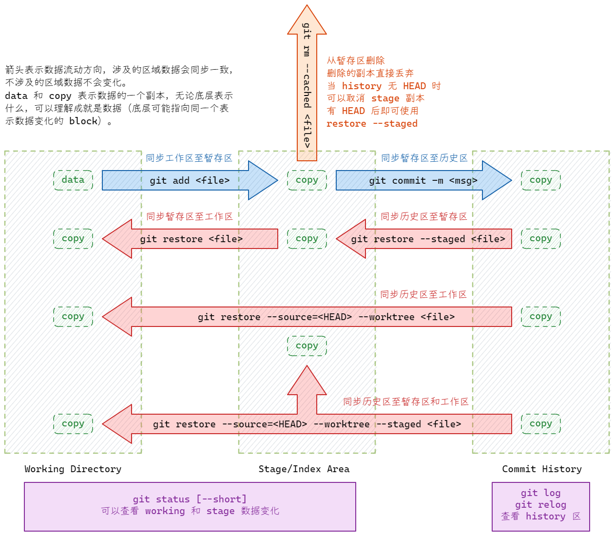
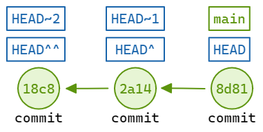

# Commonly used Git Commands of Project Workflow

版本控制和协同开发。

> 花动仪容玉润颜，温柔婀娜趁清闲，盈盈醉眼横秋水，淡淡峨眉抹远山。


## 初始配置

=== "Linux"
    ```bash title="本地用户"
    git config --global user.name "username"
    git config --global user.email "your_email@example.com"
    git config --global init.defaultbranch "main"
    ```
=== "Windows"
    ```
    # 另加 启用 autocrlf
    git config --global core.autocrlf input
    ```

SSH 认证

=== "ed25519"

    ```bash title=""
    # 生成密钥
    ssh-keygen -t ed25519 -C "your_email@example.com"

    # 添加到 ssh-agent
    eval "$(ssh-agent -s)"  # 当前 Shell 启动
    ssh-add ~/.ssh/id_ed25519  # 添加密钥

    cat ~/.ssh/id_ed25519.pub
    # 把输出内容复制到 gitee github

    # 测试
    ssh -T git@host -p port
    ```

=== "rsa"

    ```bash title=""

    # 生成密钥
    ssh-keygen -t rsa -b 4096 -C "your_email@example.com"
    ```

## 项目开始

=== "本地开始"

    ```bash
    git init
    git remote add origin git@github.com:<username>/<project>.git
    git fetch orign
    git branch --set-upstream-to=origin/main main
    git pull origin main --rebase
    # git add git commit git push
    ```

=== "远程获取"

    ```bash
    git clone git@github.com:<username>/<project>.git [local_name]
    ```

## 常用操作

### 本地数据同步（流动）

`add` `commit` `restore`

{ loading=lazy }

```bash
#### 放弃本地修改
git restore <file>

#### 放弃提交暂存去数据
git restore --staged <file>
# 或者当前还没有本地 commit 时使用
git rm --cached <file>

#### 恢复某个历史区 commit 到本地和暂存区
git restore --source=<commit_id> --staged --worktree <file>

#### 追加 commit，小的修改(不会产生新的 commit)
git commit --amend --no-edit
```

### 历史区及分支操作

`switch` `rebase` `branch`

每次的 commit 操作都会在历史区生成一个快照并加入到链式管理，每个快照都有 id，可以称为 commit。

- branch 就是某一个链条（并指向链条的最新的 commit）。
- main 是某一个 branch，在 github 等仓库中作为主分支。
- HEAD表示当前 commit，随着提交不断向前。
- tag 也是指向某一个 commit，并永久不动。

可以理解为：**所有历史区操作操作的都是 commit**，只不过有的 commit 有别称。



=== "切换分支"

    ```bash
    # 从 main 创建一个分支并切换
    git switch -c <branch_name> main
    # 从远程分支创建
    git switch -c <branch_name> origin/main

    # 查看所有分支
    git branch -a
    ```

=== "删除分支"
    ```bash
    git switch main
    git branch -D <branch_name>
    # 删除远程分支
    git push origin -d <branch_name>
    ```

=== "合并分支"

    ```bash
    git switch main
    git merge dev
    ```

=== "合并commit"

    ```bash
    # 合并多个 commit -i 交互式选择 将 pick 改为 squash
    git rebase -i HEAD~X
    ```

!!! tip

    `<file>` 可以替换为 `.` 表示当前目录所有文件

## Reference

[Git Bootcamp and Cheat Sheet](https://devguide.python.org/getting-started/git-boot-camp/)

[How to change my Git username in terminal? ](https://stackoverflow.com/questions/22844806/how-to-change-my-git-username-in-terminal)

[using-multiple-github-accounts-with-ssh-keys](https://gist.github.com/oanhnn/80a89405ab9023894df7)

[Git 的奇技淫巧](https://hellogithub.com/article/9aed28d4d64b4649bb364685ef557ae4)

[git-restore - 恢复工作树文件](https://git-scm.com/docs/git-restore/zh_HANS-CN)

[git-rebase - Reapply commits on top of another base tip](https://git-scm.com/docs/git-rebase)
